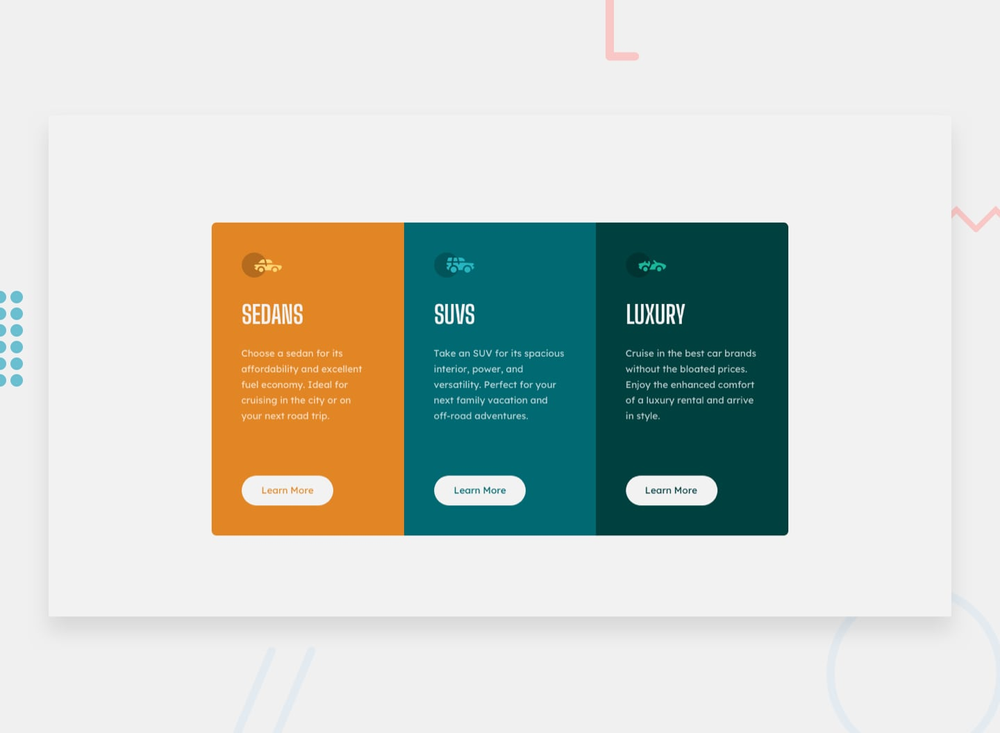

# Frontend Mentor - 3-column preview card component

## Welcome! 👋

Thanks for checking out this front-end coding challenge.

[Frontend Mentor](https://www.frontendmentor.io) challenges help you improve your coding skills by building realistic projects.

**To do this challenge, you need a basic understanding of HTML and CSS.**

## My process

### Built with

- Semantic HTML5 markup
- Flex Layout
- BEM naming convention

### Useful resources

- [CSS Guidelines](https://cssguidelin.es/#bem-like-naming)
- [BEM naming convention](https://css-tricks.com/bem-101/)
- [BEM naming examples](https://getbem.com/naming/)
